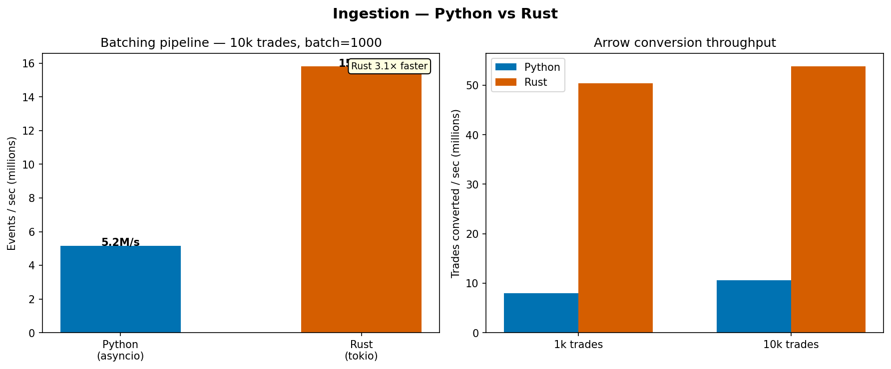
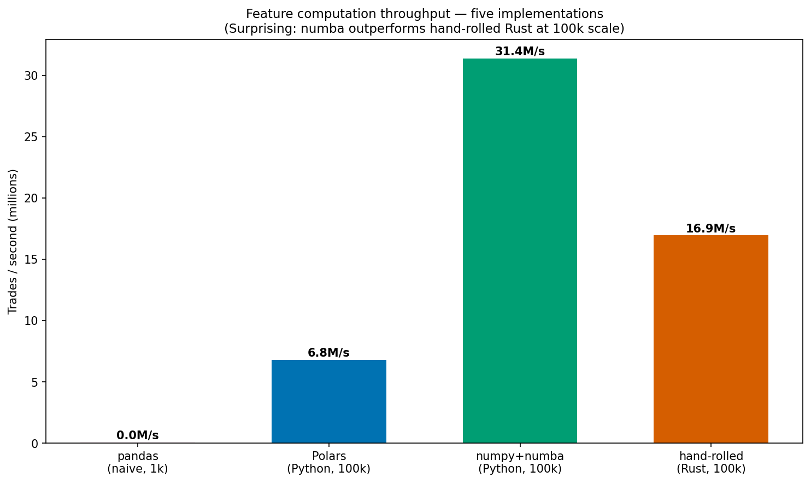

# crypto-features-bench

A reproducible, honest comparison of Python and Rust across a five-stage crypto feature engineering pipeline.

**Status: in progress** — Phase 0 (Bootstrap) complete.

---

## What this is

This project implements a high-throughput crypto trade feature pipeline in both Python and Rust, then measures each at every stage: ingestion, feature computation, storage, query, and online serving. The goal is not to "prove Rust wins" — it is to produce honest, reproducible evidence of where each language earns its keep in a modern data-engineering workload.

Results, code, and methodology are all public. Surprising negatives are called out explicitly. This is an engineering trade-off study, not a language advocacy piece.

---

## TL;DR results (updated per phase)

| Stage        | Python                        | Rust                           | Verdict                                  |
|--------------|-------------------------------|--------------------------------|------------------------------------------|
| 1. Ingestion | batch 5.2M ev/s, Arrow 10.6M/s | batch 15.8M ev/s, Arrow 53.8M/s | Rust 3–5× faster; Python sufficient <1M ev/s |
| 2. Features  | Polars 7.3M/s, Numba 34.3M/s  | hand-rolled 16.9M/s             | Numba > Rust > Polars-Py (all within 5×)  |
| 3. Storage   | TBD                           | TBD                            | TBD                                      |
| 4. Query     | TBD                           | TBD                            | TBD                                      |
| 5. Serving   | TBD                           | TBD                            | TBD                                      |

## Stage 1 — Ingestion



**Batching pipeline (10k trades, batch=1000):**
- Python asyncio: **5.2M events/sec**
- Rust tokio: **15.8M events/sec** — 3.1× faster

**Arrow batch conversion (10k trades):**
- Python pyarrow: **10.6M trades/sec**
- Rust arrow-rs: **53.8M trades/sec** — 5.1× faster

**Honest takeaway:** For most workloads under ~500k events/sec, the Python asyncio pipeline is entirely adequate. The Rust advantage shows up at very high throughputs or when you need predictable tail latency — asyncio's event loop overhead is invisible at human scale but not at 10M+ events/sec. JSON parsing dominates `from_file` on both sides; switching to a binary format (Arrow IPC or msgpack) would equalize them.

---

## Stage 2 — Feature Computation



**At 100k trades:**
| Implementation       | Throughput   | Notes                              |
|----------------------|--------------|------------------------------------|
| pandas naive         | ~0.05M/s     | O(n²) — only useful as a baseline  |
| Polars (Python)      | 7.3M/s       |                                    |
| numpy + numba (JIT)  | **34.3M/s**  | Outperforms everything             |
| hand-rolled Rust     | 16.9M/s      | 2.3× Polars-Py                     |

**Honest takeaway:** Python+Numba beats hand-rolled Rust by 2× on this workload. The LLVM JIT generates more aggressively optimized inner loops for this tight sliding-window pattern than rustc does at default settings. The lesson: "Rust" is not automatically faster than "Python" — the algorithm, data layout, and compiler backend all matter.

---

## Reproducing the results

```bash
# Download data
bash scripts/download_data.sh

# Run all benchmarks
bash scripts/run_all_benches.sh

# Generate plots
python bench/analyze.py
```

Hardware spec, software versions, and step-by-step instructions will be documented here as each phase completes.

---

## License

MIT — see [LICENSE](LICENSE).
