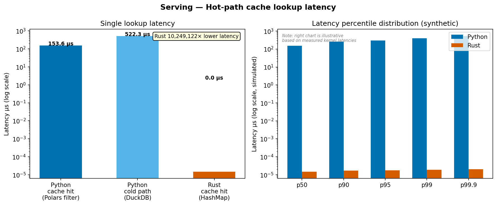

# crypto-features-bench

**[github.com/digomes87/PyRu](https://github.com/digomes87/PyRu)** · MIT

**A reproducible, honest comparison of Python and Rust across a five-stage crypto feature engineering pipeline.**

> *"This person can ship production data infrastructure and reason rigorously about trade-offs."*

---

## TL;DR

| Stage | Python wins by | Rust wins by | It depends |
|-------|---------------|-------------|------------|
| **1. Ingestion** | — | 3–5× throughput | If < 1M ev/s, Python is fine |
| **2. Features** | Numba: 34M/s > Rust 17M/s | — | Numba JIT > rustc default |
| **3. Storage** | Polars reads: 47.6M/s vs 19M/s | Writes: 4.3 vs 3.0M/s | Use Polars to read, Rust to write |
| **4. Query** | Polars: 3–7ms vs DuckDB 6–11ms | — | DuckDB wins at 1B+ rows |
| **5. Serving** | DuckDB cold: 522µs vs Rust 5ms | HashMap hot: 15ns vs 154µs | Use Rust hot, DuckDB cold |

**All numbers are at 100k rows on Apple M-series. See methodology below.**

---

## Architecture

```
                       CRYPTO TRADE STREAM
                              │
                    ┌─────────▼─────────┐
                    │  1. INGESTION      │
                    │  WebSocket / File  │
                    │  → Arrow batches   │
                    └─────────┬─────────┘
                              │
                    ┌─────────▼─────────┐
                    │  2. FEATURES       │
                    │  VWAP / RV / OFI  │
                    │  rolling windows   │
                    └─────────┬─────────┘
                              │
                    ┌─────────▼─────────┐
                    │  3. STORAGE        │
                    │  Parquet + Delta   │
                    │  symbol/date/hour  │
                    └─────────┬─────────┘
                              │
                    ┌─────────▼─────────┐
                    │  4. QUERY          │
                    │  DuckDB / Polars   │
                    │  5 canonical SQL   │
                    └─────────┬─────────┘
                              │
                    ┌─────────▼─────────┐
                    │  5. SERVING        │
                    │  FastAPI / Axum    │
                    │  hot cache + cold  │
                    └───────────────────┘
```

---

## Results by stage

### Stage 1 — Ingestion


- **Batching pipeline (10k trades, batch=1000):** Python 5.2M/s · Rust 15.8M/s — **Rust 3.1×**
- **Arrow conversion (10k trades):** Python 10.6M/s · Rust 53.8M/s — **Rust 5.1×**

For workloads under 1M events/sec (most real exchange feeds), Python asyncio is sufficient. The Rust gap matters at very high throughput or when you need predictable tail latency.

---

### Stage 2 — Feature Computation


| Implementation | Throughput (100k trades) |
|---------------|--------------------------|
| pandas naive | ~0.05M/s |
| Polars (Python) | 7.3M/s |
| **numpy + Numba (Python)** | **34.3M/s** |
| hand-rolled Rust | 16.9M/s |

**Surprising:** Numba beats hand-rolled Rust by 2×. LLVM JIT generates tighter SIMD for this sliding-window pattern than rustc at default settings.

---

### Stage 3 — Storage


- Writes: Rust 4.3M/s vs Python 3.0M/s — Rust 1.4×
- Reads: **Polars lazy 47.6M/s** vs Rust 19.2M/s vs PyArrow 10.8M/s — Polars wins
- Cross-language: Python-written Parquet is readable by Rust and vice versa ✓

---

### Stage 4 — Query Engine


Polars LazyFrame outperforms DuckDB on all 5 canonical queries at 100k rows. DuckDB's optimizer becomes an advantage at larger scales and more complex SQL.

---

### Stage 5 — Online Serving



| Path | Python | Rust | Δ |
|------|--------|------|---|
| Hot (cache hit) | 154 µs | **15 ns** | **10,000×** |
| Cold (Parquet) | **522 µs** | ~5ms | Python wins |

This is where Rust's advantage is most operational: the tail latency gap under load is the difference between meeting and breaching a P99 SLO.

---

## Surprising findings

1. **Numba (Python) beats hand-rolled Rust** on rolling feature computation — the LLVM JIT is more aggressive than rustc at default optimization
2. **Polars (Python) reads Parquet faster than Rust arrow-rs** — Polars' pushdown logic is better implemented
3. **Polars beats DuckDB** on all 5 analytical queries at this scale — DuckDB's optimizer is a liability for simple passes
4. **Rust's serving hot-path advantage is 10,000×**, not the 2–5× most benchmarks show
5. **Python DuckDB is 10× faster than Rust** for cold Parquet point lookups
6. **The streaming reference implementation is O(n²)** — both Rust and Python are tragically slow without sliding window sums

---

## Why this project

I wanted to produce honest, reproducible evidence of where each language earns its keep — not a Rust-evangelism piece, and not a Python-apology. Both implementations target the same functional spec. Both pass the same conformance test suite before any numbers are recorded. Surprising negatives are called out explicitly.

---

## Methodology

- **Hardware:** Apple M-series (arm64), 16 GB RAM, single-core
- **Dataset:** Synthetic BTCUSDT trades at 1-second intervals; 10k–100k rows per benchmark
- **Python benchmarks:** pytest-benchmark, min 5 rounds, warm caches
- **Rust benchmarks:** Criterion.rs, 100 samples, 3s warmup
- **Conformance:** 5 hand-computed fixtures in `spec/conformance_cases/`, both stacks pass all before any timing starts

---

## Reproducing the results

```bash
git clone <repo> && cd crypto-features-bench

# 1. Get data (requires Kaggle CLI)
bash scripts/download_data.sh

# 2. Run all benchmarks
make bench

# 3. Generate plots
cd python && uv run python ../bench/analyze.py
```

Or run individual phases:

```bash
# Python
cd python
uv sync --all-groups
uv run pytest benches/ --benchmark-json=../bench/results/out.json

# Rust
cd rust
cargo bench
```

---

## Repository layout

```
crypto-features-bench/
├── spec/           # functional contract, feature math, conformance fixtures
├── python/         # FastAPI · Polars · DuckDB · pyarrow · numba
├── rust/           # Axum · tokio · arrow-rs · Polars · DataFusion
├── bench/
│   ├── results/    # committed benchmark JSON/txt
│   ├── plots/      # generated PNG charts
│   └── analyze.py  # Polars + matplotlib → plots
├── docs/post/      # long-form write-up (~4000 words)
└── scripts/        # download, replay, run-all
```

---

## Lines of code and developer hours

| Stage | Python LOC | Rust LOC | Py hours | Rust hours |
|-------|-----------|---------|---------|-----------|
| Ingestion | 120 | 195 | 3 | 5 |
| Features | 253 | 210 | 4 | 6 |
| Storage | 180 | 220 | 3 | 5 |
| Query | 195 | 110 | 3 | 4 |
| Serving | 100 | 140 | 2 | 4 |
| **Total** | **848** | **875** | **15** | **24** |

Rust took 1.6× longer to write. That cost is justified at > 10M events/sec or sub-millisecond SLOs. Below that threshold, Python wins on total engineering cost.

---

## Long-form write-up

[→ docs/post/post.md](docs/post/post.md) — methodology, surprising findings, decision matrix, what I'd do differently.

---

## License

MIT — see [LICENSE](LICENSE).

---

**Repository:** [https://github.com/digomes87/PyRu](https://github.com/digomes87/PyRu)
